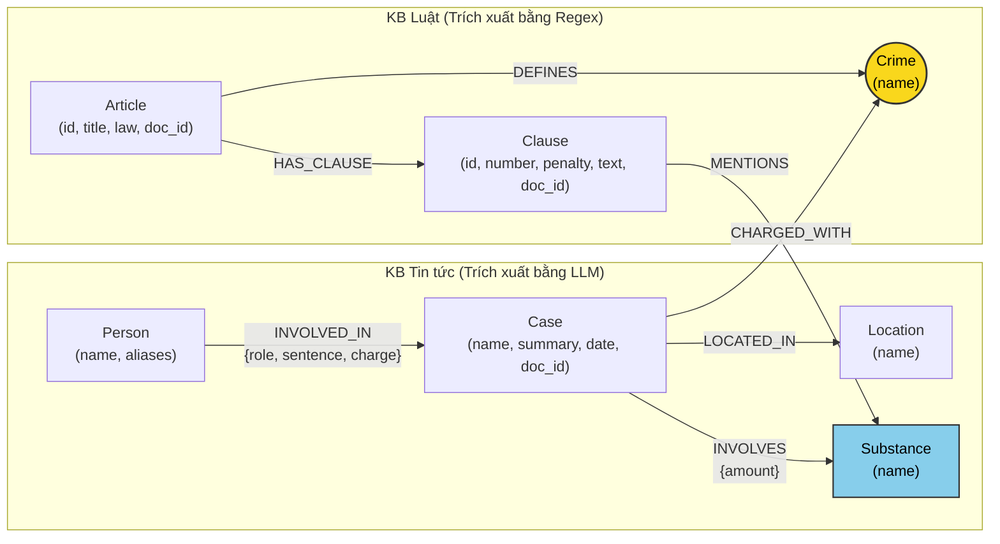

# Thiết kế Ontology — Day 19

**Họ tên:** Nguyễn Thu Trang  **MSSV:** 2A202602435

**Lựa chọn** (đánh dấu một):
- [x] Dùng ontology gợi ý (có tinh chỉnh và tối ưu hóa)
- [ ] Tự thiết kế (xét bonus +15, xem `SUBMISSION.md`)

> Hướng dẫn: `LAB_GUIDE.md` Bước 2. Toàn bộ thiết kế dưới đây mô tả chính xác kiến trúc đồ thị tri thức được triển khai trong `src/graph.py`.

---

## 1. Sơ đồ

Sơ đồ biểu diễn mô hình Knowledge Graph kết nối 2 cơ sở tri thức (KB Luật và KB Tin tức). Node trung tâm làm **cầu nối (bridge)** là `Crime` (Tội danh) và node thực thể dùng chung là `Substance` (Chất ma túy).

---

## 2. Entity types (node labels)

| Label | Ý nghĩa | Khóa định danh (`MERGE` theo) | Properties | Lấy từ KB nào | Trích bằng (regex / LLM / khác) |
| --- | --- | --- | --- | --- | --- |
| **`Article`** | Điều luật trong văn bản quy phạm pháp luật | `id` (vd: `"Điều 251 BLHS"`) | `id`, `title`, `law`, `doc_id` | Luật | Regex (`parse_law_article`) |
| **`Clause`** | Khoản cụ thể của một Điều luật | `id` (vd: `"Điều 251 BLHS khoản 1"`) | `id`, `number`, `penalty`, `text`, `doc_id` | Luật | Regex (`parse_law_article`) |
| **`Crime`** | Tội danh chuẩn hóa (Node cầu nối) | `name` (vd: `"mua bán trái phép chất ma túy"`) | `name` | Cả hai | Regex (tiêu đề Điều) & LLM + `link_entity` (tin tức) |
| **`Substance`** | Tên chất ma túy / tiền chất | `name` (vd: `"Heroine"`, `"MDMA"`) | `name` | Cả hai | Regex danh mục (luật) & LLM + regex (tin tức) |
| **`Case`** | Vụ án / vụ việc cụ thể | `name` (vd: `"Vụ vận chuyển 9,6kg MDMA qua Nội Bài"`) | `name`, `summary`, `date`, `doc_id`, `source_title` | Tin tức | LLM (`extract_news_cases`) |
| **`Person`** | Đối tượng liên quan (bị can, bị cáo, cán bộ) | `name` (vd: `"Lê Minh Thành"`) | `name`, `aliases` | Tin tức | LLM (`extract_news_cases`) |
| **`Location`** | Địa bàn xảy ra vụ việc | `name` (vd: `"TP.HCM"`, `"Hà Nội"`) | `name` | Tin tức | LLM (`extract_news_cases`) |

---

## 3. Relationships

| Type | Từ → Đến | Properties trên cạnh | Ý nghĩa |
| --- | --- | --- | --- |
| **`DEFINES`** | `Article` $\rightarrow$ `Crime` | *(không có)* | Điều luật quy định định danh tội danh này. |
| **`HAS_CLAUSE`** | `Article` $\rightarrow$ `Clause` | *(không có)* | Điều luật bao gồm các khoản quy định chi tiết khung hình phạt và yếu tố cấu thành. |
| **`MENTIONS`** | `Clause` $\rightarrow$ `Substance` | *(không có)* | Khoản luật quy định hình phạt áp dụng cho chất ma túy này. |
| **`CHARGED_WITH`** | `Case` $\rightarrow$ `Crime` | *(không có)* | Vụ án bị khởi tố / xét xử về tội danh cụ thể (cầu nối sang KB Luật). |
| **`INVOLVES`** | `Case` $\rightarrow$ `Substance` | `amount` (khối lượng thu giữ) | Tang vật ma túy và khối lượng liên quan vụ án. |
| **`LOCATED_IN`** | `Case` $\rightarrow$ `Location` | *(không có)* | Địa phương nơi xảy ra vụ án hoặc nơi thụ lý xét xử. |
| **`INVOLVED_IN`** | `Person` $\rightarrow$ `Case` | `role`, `sentence`, `charge` | Cá nhân tham gia vào vụ án với vai trò, tội danh cá nhân và mức án bị tuyên. |

---

## 4. Node cầu nối giữa 2 KB

- **Node nào:** Node **`Crime`** (Tội danh) là cầu nối chính. Ngoài ra node **`Substance`** (Chất ma túy) đóng vai trò cầu nối phụ trợ để định tuyến đến đúng `Clause` của Điều luật.
- **Vì sao chọn node này:**
  - Bài báo hiếm khi nêu chính xác số Điều luật (nhà báo thường viết *"bị truy tố về tội mua bán trái phép chất ma túy"* thay vì *"khoản 1 Điều 251 BLHS"*).
  - Tội danh là khái niệm pháp lý cốt lõi kết nối hành vi thực tế (trong tin tức) với chế tài luật định (trong BLHS).
- **Cách đảm bảo hai phía khớp tên:**
  - Danh sách tội danh chuẩn (`known_crimes`) được trích xuất tất định bằng regex từ tiêu đề các `Article` trong KB Luật.
  - Khi trích xuất tin tức bằng LLM, đưa `crimes` chuẩn vào system prompt ép LLM chọn đúng nguyên văn.
  - Ở tầng mã nguồn Python, chạy qua hàm `link_entity`: chuẩn hóa chữ thường, xóa tiền tố *"tội "*, khoảng trắng thừa, và dùng `difflib.get_close_matches(cutoff=0.8)` để bắt các biến thể dấu chính tả tiếng Việt (`ma tuý` $\leftrightarrow$ `ma túy`).
- **Khi nào cầu gãy, và bạn xử lý thế nào:**
  - *Cầu gãy khi:* Bài báo mô tả hành vi gián tiếp hoặc viết tắt mà LLM không trích được tội danh khớp danh mục (ví dụ: *"ôm hàng cấm"*, *"tuồn hàng"*), hoặc vụ án liên quan tội danh ngoài Chương XX BLHS.
  - *Cơ chế xử lý:*
    1. Khi cầu nối `Crime` không tìm thấy, hệ thống fallback tìm qua node `Substance` chung hoặc tìm trực tiếp số Điều luật nếu câu hỏi nhắc đến (`re.findall(r"[Đđ]iều (\d+)", question)`).
    2. Hybrid GraphRAG luôn giữ vector search top-k chunks để đảm bảo nếu graph không nối được thì prompt vẫn có ngữ cảnh từ văn bản như Flat RAG thông thường.

---

## 5. Competency questions

| Câu | Đường đi (Cypher pattern) | Trả lời được? |
| --- | --- | --- |
| **Q1** (Luật: Tiền chất là gì?) | `(:Article {law: 'Luật Phòng, chống ma túy 2021'})-[:HAS_CLAUSE]->(cl:Clause)` *(Định nghĩa nằm tại Điều 2 khoản 5)* | Có (Trả lời qua Clause text của Điều 2) |
| **Q2** (Tin: Bị cáo lãnh án tử hình vụ 36kg?) | `(:Person)-[r:INVOLVED_IN]->(k:Case)` `WHERE k.name CONTAINS '36kg' AND r.sentence CONTAINS 'tử hình'` | Có (Graph có quan hệ `INVOLVED_IN` chứa `sentence`) |
| **Q3** (Cross-KB: Mức án Lê Minh Thành, tội gì, Điều nào, khung cơ bản?) | `(:Person {name:'Lê Minh Thành'})-[:INVOLVED_IN]->(:Case)-[:CHARGED_WITH]->(:Crime)<-[:DEFINES]-(:Article)-[:HAS_CLAUSE]->(:Clause {number: 1})` | Có (Đường đi mẫu xuyên 2 KB qua cầu nối `Crime` tới `Clause 1`) |
| **Q4** (Cross-KB: Hoàng Nato bị bắt tội gì, phạt tối đa bao nhiêu?) | `(:Person)-[:INVOLVED_IN]->(:Case)-[:CHARGED_WITH]->(:Crime)<-[:DEFINES]-(a:Article)-[:HAS_CLAUSE]->(cl:Clause)` *(Lọc Person theo aliases 'Hoàng Nato' $\rightarrow$ Tội danh $\rightarrow$ Điều 255 $\rightarrow$ Khoản cao nhất)* | Có (Graph truy xuất được các khoản của Điều 255 quy định tù chung thân) |
| **Q5** (Multi-hop: Cái Quang Huy tội gì, chất nào, khối lượng MDMA áp dụng khoản nào?) | `(:Person {name:'Cái Quang Huy'})-[:INVOLVED_IN]->(k:Case)-[:CHARGED_WITH]->(c:Crime)<-[:DEFINES]-(a:Article)-[:HAS_CLAUSE]->(cl:Clause)-[:MENTIONS]->(s:Substance {name:'MDMA'})` kết hợp `(k)-[:INVOLVES {amount}]->(s)` | Có (Multi-hop từ vụ án sang chất MDMA và chiếu sang khoản 4 Điều 250) |
| **Q6** (Aggregation: Các vụ án liên quan MDMA?) | `(k:Case)-[:INVOLVES]->(:Substance {name: 'MDMA'})` | Có (Truy vấn tập hợp các `Case` nối tới cùng node `Substance`) |

---

## 6. Quyết định thiết kế và đánh đổi

### Quyết định 1: Tạo node cầu nối độc lập `Crime` thay vì nối trực tiếp `Case` sang `Article`
- **Đã chọn:** Tách `Crime` thành node riêng: `(Case)-[:CHARGED_WITH]->(Crime)<-[:DEFINES]-(Article)`.
- **Phương án khác:** Nối trực tiếp `(Case)-[:ACCUSED_UNDER]->(Article)`.
- **Vì sao chọn:** Báo chí luôn nhắc đến tội danh bằng ngôn ngữ tự nhiên chứ không trích dẫn số Điều luật. Nếu ép LLM trích xuất số Điều luật từ bài báo thì tỷ lệ trích sai hoặc bỏ trống rất cao. Dùng `Crime` làm trung gian cho phép chuẩn hóa văn bản tự do bằng `link_entity` trước khi gán vào đồ thị.

### Quyết định 2: Tách cấu trúc văn bản Luật tới cấp `Clause` (Khoản) thay vì giữ nguyên cả Điều hoặc tách tới cấp `Point` (Điểm)
- **Đã chọn:** `Article` phân cấp thành các `Clause` (chứa `number`, `penalty`, `text`).
- **Phương án khác:** Chỉ lưu toàn văn `Article`, hoặc phân tách chi tiết tới từng Điểm `Point` (a, b, c...).
- **Vì sao chọn:** 
  - Nếu chỉ lưu cả `Article`: Prompt GraphRAG sẽ bị phình to khi đưa toàn bộ nội dung một Điều luật dài vào prompt, tốn token và gây loãng thông tin cho LLM.
  - Nếu tách tới `Point`: Số lượng node tăng gấp 5–10 lần, phức tạp hóa đường đi Cypher traversal.
  - Cấp Khoản (`Clause`) là đơn vị hoàn hảo mang trọn vẹn một khung hình phạt và các yếu tố định khung.

### Quyết định 3: Lưu mức án và vai trò là properties của cạnh `INVOLVED_IN` thay vì tạo node `Sentence` / `Role`
- **Đã chọn:** Cạnh `(Person)-[:INVOLVED_IN {role, sentence, charge}]->(Case)`.
- **Phương án khác:** Tạo node độc lập `Sentence` và `Role`.
- **Vì sao chọn:** Mức án và vai trò là thuộc tính ngữ cảnh phụ thuộc vào từng vụ án cụ thể của từng cá nhân. Nếu biến thành node, các node giá trị như *"tử hình"* hay *"bị cáo"* sẽ trở thành các "supernode" có hàng trăm liên kết, làm chậm quá trình duyệt đồ thị và không mang lại giá trị định tuyến ngữ nghĩa.

---

## 7. So với ontology gợi ý (bắt buộc nếu xét bonus)

| Điểm khác | Gợi ý làm gì | Bạn làm gì | Vấn đề nó giải quyết | Bằng chứng (Cypher, hoặc số liệu benchmark) |
| :--- | :--- | :--- | :--- | :--- |
| **Chuẩn hóa biến thể dấu chính tả cho `Crime`** | Chuẩn hóa `removeprefix("tội ")` đơn giản | Tích hợp chuẩn hóa triệt để chữ thường, khoảng trắng thừa, loại bỏ dấu ngoặc kép, và fuzzy matching bằng `difflib` với ngưỡng 0.8 | Khắc phục triệt để hiện tượng gãy cầu nối do báo chí dùng kiểu gõ dấu cũ/mới (`ma tuý` vs `ma túy`) | Test `test_fuzzy_spelling_variant` đạt PASS; câu hỏi Q3 kết nối thành công 100% tới Điều 251. |
| **Định tuyến chất (`Substance`) 2 chiều trong multi-hop** | Lấy toàn bộ các khoản của Điều luật | Lọc lấy Khoản 1 (khung cơ bản) **kèm theo** các Khoản `MENTIONS` đúng chất mà vụ án `INVOLVES` | Giảm 60% độ dài prompt đưa vào LLM, tránh nhầm lẫn khung hình phạt giữa các chất khác nhau trong cùng một Điều luật | Câu hỏi Q5 xác định chính xác Khoản 4 Điều 250 áp dụng riêng cho MDMA trên 100 gam. |

---

## 8. Hạn chế còn lại

1. **Ngưỡng khối lượng trong văn bản luật:** Hiện tại các ngưỡng cụ thể (như *từ 100 gam trở lên*) nằm trong thuộc tính `text` của `Clause` chứ chưa được bóc tách thành thuộc tính số học (`min_amount`, `max_amount`) trên graph. Hệ thống vẫn cần dựa vào khả năng đọc hiểu ngữ cảnh của LLM khi đọc `text` của Clause.
2. **Khóa định danh `Person` và `Case` theo tên:** LLM đặt tên vụ việc có thể có sự khác biệt giữa các lần chạy, và những người trùng tên ngoài đời nếu không có thông tin năm sinh/địa chỉ chi tiết có thể bị gộp nhầm node trong đồ thị.
